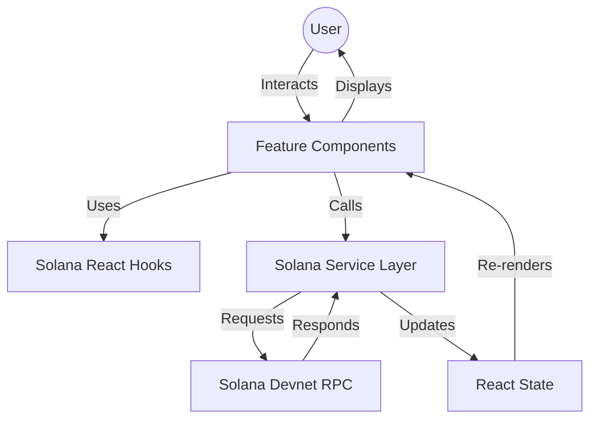
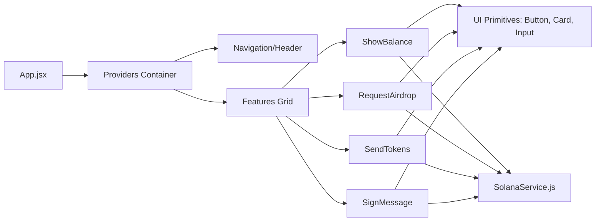

# SolBridge – Production-Ready Solana DApp

SolBridge is a high-performance, visually stunning Solana Web3 dashboard. Transformed from a basic prototype into a professional-grade application, it features a premium "Glassmorphism" dark theme, a centralized service architecture, and robust state management.

## 🚀 Features

- **Wallet Integration**: Seamless connection via `@solana/wallet-adapter`.
- **Real-time Balance**: Check Devnet SOL balance with instant refresh.
- **Airdrop Portal**: Request test SOL directly to your connected wallet.
- **Secure Transfers**: Transfer SOL to any valid public key with transaction confirmation.
- **Message Signing**: Cryptographically sign and verify messages using Ed25519.
- **Premium UI**: Dark-mode-first design with smooth gradients and tactile feedback.

---

## 🏗️ Architecture & Flow

### Application Flow
The application follows a modular "Service-Feature-UI" pattern to ensure maintainability and scalability.



### Component Graph


---

## 📂 Project Structure

```text
src/
├── components/
│   ├── UI.jsx            # Reusable UI primitives (Card, Button, Input)
│   ├── ShowBalance.jsx   # Wallet balance logic & UI
│   ├── RequestAirdrop.jsx# Devnet faucet interaction
│   ├── SendTokens.jsx    # Token transfer module
│   └── SignMessage.jsx   # Cryptographic signing module
├── services/
│   └── solanaService.js  # Centralized Solana RPC & interaction logic
├── App.jsx               # Root layout & Provider orchestration
├── App.css               # Base Tailwind imports
└── index.css             # Design system & Premium styles
```

---

## 🛠️ Tech Stack

- **React 19** & **Vite**
- **Tailwind CSS 4** (Modern Design)
- **Solana Web3.js** (Blockchain Interaction)
- **@solana/wallet-adapter** (Wallet connection)
- **@noble/curves** (Cryptographic verification)

---

## 🏁 Getting Started

1. **Install Dependencies**:
   ```bash
   npm install
   ```

2. **Run Development Server**:
   ```bash
   npm run dev
   ```

3. **Use Devnet**:
   Ensure your wallet (Phantom/Solflare) is set to **Devnet** before performing transactions.

---

## 🛡️ Security
This dApp is designed for **Devnet** testing. Never use your mainnet private keys or connect to untrusted applications.
