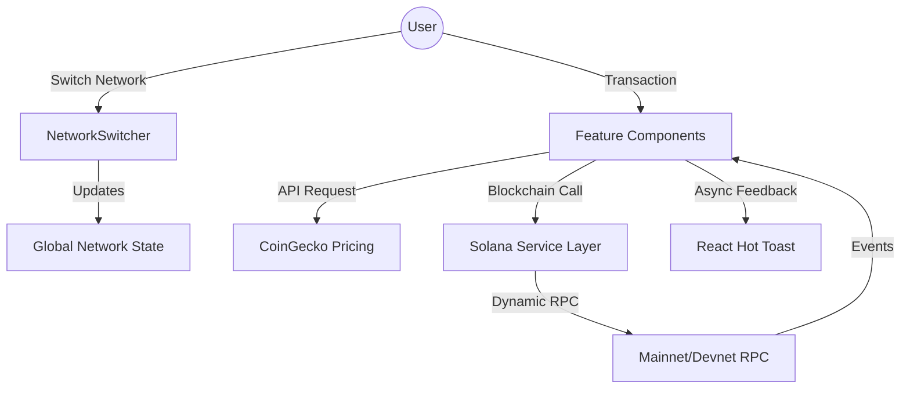
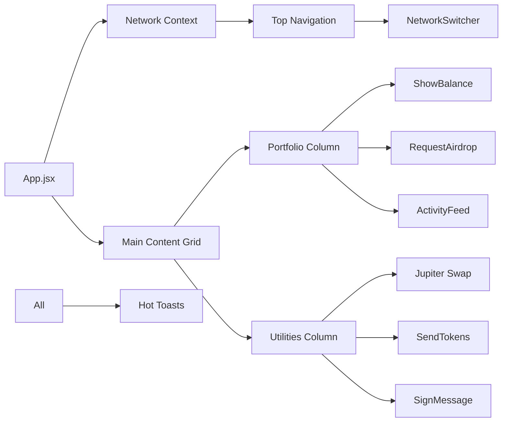

# SolBridge – Production-Ready Solana DApp

SolBridge is a high-performance, visually stunning Solana Web3 dashboard. Transformed from a basic prototype into a professional-grade application, it features a premium "Glassmorphism" dark theme, a centralized service architecture, and robust state management.

## 🚀 Features

- **Multi-Network Support**: Seamlessly switch between **Mainnet-beta** and **Devnet**.
- **Real-time Price Feed**: Live SOL/USD price conversion via CoinGecko API.
- **Pulse Activity Feed**: On-chain transaction history with real-time status tracking.
- **Jupiter Swap**: Deep DEX integration for token swaps (Powered by Jupiter).
- **Wallet Integration**: Unified connection via `@solana/wallet-adapter`.
- **Enhanced Feedback**: Real-time asynchronous status updates via **React Hot Toast**.
- **Premium UI**: Glassmorphism aesthetic with floating animations and vibrant gradients.

---

## 🏗️ Architecture & Flow

### Application Flow
The application follows a modular "Service-Feature-UI" pattern to ensure maintainability and scalability.



### Component Graph


---

## 📂 Project Structure

```text
src/
├── components/
│   ├── UI.jsx              # Reusable UI primitives (Card, Button, Input)
│   ├── NetworkSwitcher.jsx # Multi-cluster selector
│   ├── ShowBalance.jsx     # Balance & Pricing logic
│   ├── ActivityFeed.jsx    # Real-time transaction history
│   ├── RequestAirdrop.jsx  # Network-aware Devnet faucet
│   ├── SendTokens.jsx      # Polished transfer hub
│   ├── Swap.jsx            # Jupiter Terminal integration
│   └── SignMessage.jsx     # Security Signer module
├── services/
│   └── solanaService.js    # Data fetching & Blockchain logic
├── App.jsx                 # Global state & Layout Nexus
└── index.css               # Design system & Design Tokens
```

---

## 🛠️ Tech Stack

- **React 19** & **Vite**
- **Tailwind CSS 4**
- **Solana Web3.js**
- **Jupiter SDK** (Token Swaps)
- **CoinGecko API** (Pricing)
- **React Hot Toast** (UX)
- **@noble/curves** (Cryptography)

---

## 🏁 Getting Started

1. **Install Dependencies**:
   ```bash
   npm install
   ```

2. **Run Development Server**:
   ```bash
   npm run dev
   ```

3. **Use Devnet**:
   Ensure your wallet (Phantom/Solflare) is set to **Devnet** before performing transactions.

---

## 🛡️ Security
This dApp is designed for **Devnet** testing. Never use your mainnet private keys or connect to untrusted applications.
